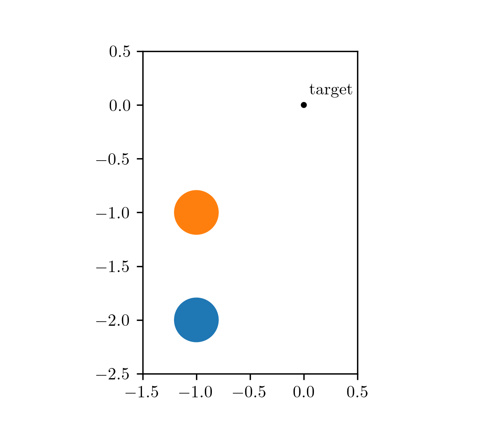
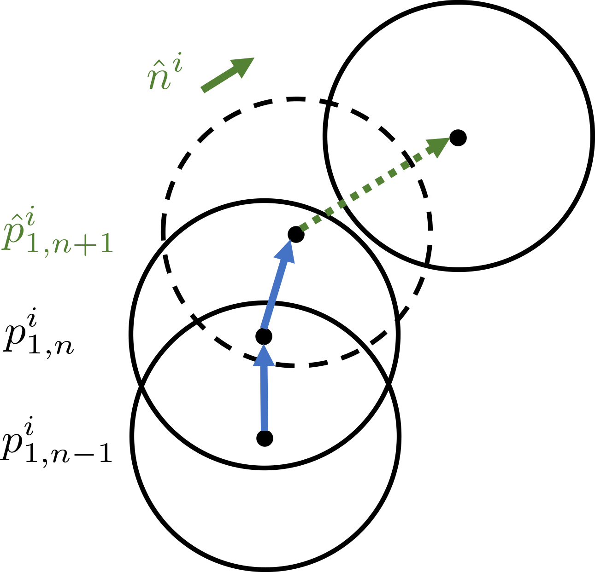
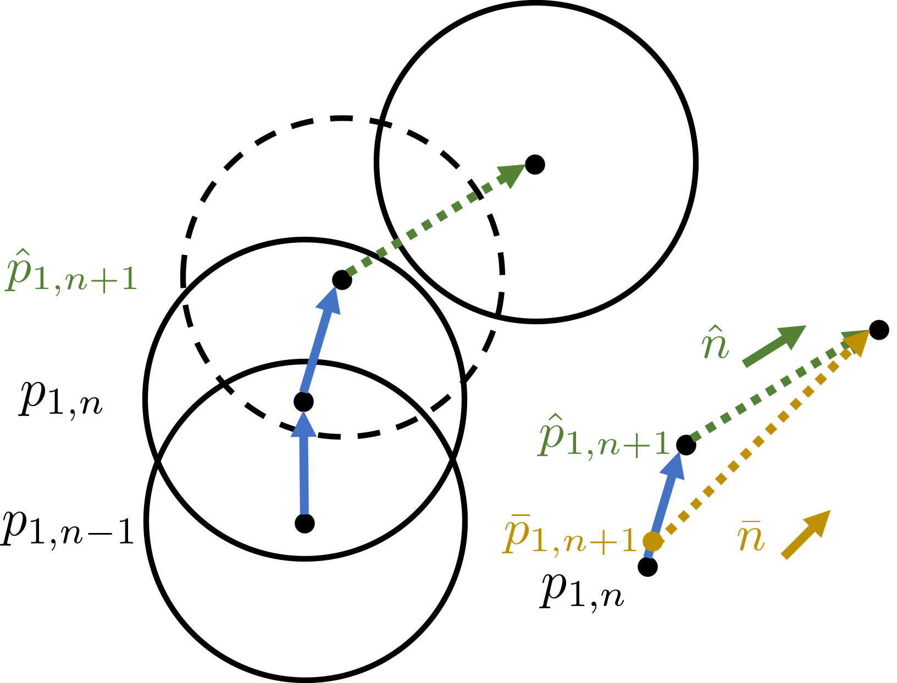

> Note: If you have any objections or suggestions regarding the content of this article, you can contact the author of the [original post](https://desmondzhong.com/blog/2023-improving-gradient-computation/).

In this blog post, I'd like to discuss our work on improving gradient computation for differentiable simulation. This is a joint work with Jiequn Han from Flatiron Institute and my colleagues Biswadip Dey and Georgia Olympia Brikis at Siemens. This work has been accepted by the [5th Annual Conference on Learning for Dynamics and Control](https://l4dc.seas.upenn.edu/).

[[paper](https://proceedings.mlr.press/v211/zhong23a/zhong23a.pdf)] [[arXiv](https://arxiv.org/pdf/2305.00092.pdf)] [[code](https://github.com/DesmondZhong/diff_sim_improve_grads)]

# What is differentiable simulation

If we ask ChatGPT this question, this is part of the output:

> Differentiable simulation is an approach in which the simulations of a physical system or process are designed to be differentiable with respect to their parameters. This means that the gradients or derivatives of the simulation output with respect to the input parameters can be computed efficiently. This is particularly useful in machine learning and optimization applications, where gradient information is often used to adjust model parameters to minimize error or improve performance.
>
> Differentiable simulations have found applications in various domains, including robotics, computer graphics, physics-based modeling, and optimization. Some of the advantages of differentiable simulation include:
>
> - Faster convergence: Gradient information can lead to faster convergence in optimization problems compared to methods that do not use gradient information.
> - Improved learning: In machine learning, differentiable simulations can be used to create more accurate models, as they enable end-to-end training and seamless integration of the simulation into the learning process.
> - Inverse problem solving: Differentiable simulations can help solve inverse problems, where the goal is to estimate input parameters given the observed output, by providing gradient information to guide the search process.
> - Sensitivity analysis: Differentiable simulations allow for efficient sensitivity analysis, which is the study of how changes in the input parameters affect the output of a system.

I mostly agree. In other words, differentiable simulation brings the automatic differentiation paradigm to physics simulation. By implementing these simulations within autodiff frameworks such as TensorFlow, PyTorch, or JAX, gradient computation is automatically handled by the framework. For example, [Brax](https://github.com/google/brax) is such a physics engine implemented in JAX, which is optimized for massive parallel rigid-body simulation. Implementing simulations using TensorFlow or PyTorch might result in less efficient simulations, as these frameworks are not specifically designed for physics simulations. Nevertheless, [Taichi](https://github.com/taichi-dev/taichi) and [Warp](https://github.com/NVIDIA/warp) aim to address this issue by enabling users to create efficient physics simulations that run on GPUs with ease. Furthermore, with their built-in automatic differentiation capabilities, these tools make it easy to compute gradients for downstream optimization tasks, such as optimal control or inverse design.

## Collisions and contacts

However, there exists challenges in making the whole simulation differentiable. One such challenge arises from collisions, as they can cause sudden changes (discontinuities) in an object's velocity when objects collide.

> From a modelling standpoint, we can assume that the contact surface is deformable and use a spring-damper system to model the contact force. In this way, collisions are typically resolved over multiple time steps and the process can be described as a continuous model. This class of models is usually referred to as _compliant models_ or _penalty-based models_. Implementing differentiable simulation is straightforward in these cases due to the absence of discontinuity. However, compliant models might be hard to tune (e.g. Figure 5 in our [previous work](https://arxiv.org/abs/2207.05060)). In this article, we focus on contact models that are based on velocity impulses.

**If there exists discontinuity in velocity, how is it possible to make the simulation differentiable?**

When I began researching this topic, I also had this question. If you're asking the same thing, you're not alone!

Consider what occurs when we "resolve" a collision. Let's assume we have a contact model that calculates the velocity impulse resulting from the collision. The post-collision velocity is then equal to the pre-collision velocity plus the velocity impulse, as follows:

$$ v^+ = v^- + \Delta v. $$

Here's the key insight: **If we can compute the velocity impulse $\Delta v$ in a differentiable manner, the post-collision velocity $v^+$ is also calculated differentiably, making the entire simulation differentiable.**

In other words, if we have a differentiable contact model that allows gradients to be back-propagated through it, we can integrate it as a differentiable layer in our simulation pipeline. This enables us to compute the gradients of a loss function with respect to certain input parameters and use those gradients to update input parameters to minimize the loss function. We have explored this idea in our previous work on [differentiable contact models](https://github.com/Physics-aware-AI/DiffCoSim).

## Time-of-impact (TOI-Position)

This doesn't mean we solve all the challenges introduced by collisions and contacts. In the [diffTaichi](https://arxiv.org/abs/1910.00935) paper, [Yuanming Hu](https://yuanming.taichi.graphics/) et al. find that collisions can cause the calculated gradient to be entirely incorrect. The video below clearly demonstrates this issue.

<iframe width="560" height="315" src="https://www.youtube.com/embed/Z1xvAZve9aE" title="YouTube video player" frameborder="0" allow="accelerometer; autoplay; clipboard-write; encrypted-media; gyroscope; picture-in-picture; web-share" allowfullscreen></iframe>

Inspired by this observation, [diffTaichi](https://arxiv.org/abs/1910.00935) suggests calculating the exact time of impact (TOI) and adding a correction term to the post-collision position based on the TOI. While the added correction term doesn't significantly affect the forward simulation, it greatly improves gradient computation. The paper verifies this improvement in several optimization tasks.

We refer to this technique as TOI-Position. Does TOI-Position solve all the issues introduced by collision and time discretization? Not really, as we will see below.

# Motivating problem

Our motivating problem comes from an optimal control problem studied by [Wei Hu et al.](https://arxiv.org/abs/2205.08622), who used a different class of method called hybrid minimum principle (HMP). As demonstrated in the following animations, we have two balls on a frictionless plane. We can apply forces to Ball 1 to move it around. Our objective is to push Ball 1 in such a way that it strikes Ball 2, causing Ball 2 to reach the target position after a fixed period of time. This type of problems can be mathematically formulated as an optimal control problem.

The animation on the left shows the trajectory before optimization, where we apply a constant control to Ball 1. The animation on the right shows the trajectory under the analytical optimal control. (Since this example only involves elastic frictionless collision, we are able to compute the analytical optimal control.)

|before optimization | after optimization |
|:---:|:---:|
|||

Differentiable simulation is an ideal candidate for solving optimal control problems, which involve determining the control inputs that minimize a given objective function. By employing differentiable simulation, we can compute the gradients of the objective function with respect to the control inputs. We can then set the objective function as the loss and control inputs as learnable parameters. In other words, we use gradient-based optimization approaches to learn an optimal control sequence that minimize the objective function.

The idea seems straightforward. I implement this idea in both PyTorch and Taichi, with the TOI-Position fix. Here are the learning curves, along with the analytical optimal loss.

Notice the gap between the converged loss and the analytical optimal loss? This indicates that the differentiable simulation does not converge to the optimal solution. To confirm this, let's plot the learned control sequences and compare them to the analytical optimal control sequence.

The shapes are distinctly different. Why does differentiable simulation fail to converge to the analytical optimal solution?

## A hint of the issue

To understand the reason of this failure, we initialize the learning with the analytical solution, ensuring that the initial loss corresponds to the analytically optimal loss. Since the loss cannot be further reduced theoretically, it should ideally remain constant throughout the iterations. However...

Surprisingly, the loss increases during specific iterations! The right panel is a close-up view of the first 100 iterations. This unexpected behavior provides us with a clue to investigate the reasons behind the failure of the differentiable simulation.

## The reason behind loss increase

It turns out that the increase of loss appears when the time step at which the collision happens changes over optimization iterations. For example, if in iteration $i$, the collision happens in time step $n$ while in iteration $i+1$, the collision doesn't happend in time step $n$, the loss might increase. The underlying mechanism behind this phenomenon can be explained by the following diagram.

|||
|:---:|:---:|
|||

The left panel illustrates the positions of the balls in iteration $i$. Here $p_{1, n-1}^i$ and $p_{1, n}^i$ denote the position of the Ball 1 at time step $n-1$ and $n$ in iteration $i$, respectively. The collision happens in time step $n+1$, and $\hat{p}_{1, n+1}^i$ denotes the penetrated position of Ball 1, which is an intermediate variable used to resolve the collision. The direction of the post-collision velocity of Ball 2 is determined by the _penetration direction_, indicated by the green arrow.

Assume that after a gradient update, the position of Ball 1 change to the one shown on the right, where the collision happens in time step $n$ instead of time step $n+1$. Now the direction of the post-collision velocity of Ball 2 is determined by the _penetration direction_ indicated by the red arrow. As the change of penetration direction (from green arrow to red arrow) is not continuous, the change in the post-collision velocity of Ball 2 is also not continuous. Consequently, the final position of Ball 2 experiences a sudden change over these iterations, which could lead to an increase in the loss since the objective depends on the final position of Ball 2.

This discontinuity in post-collision velocity between consecutive gradient updates is the main reason behind the loss increase.

## How come this issue hasn't been discovered before?

I think there are two reasons:

- Most of the examples studied in differentiable simulation literature only involve collisions where the contact normal remains fixed during gradient updates. For instance, collisions with the ground fall under this category. If the contact normal is fixed, this issue likely wouldn't arise.
- We have studied an example where the analytical solution can be obtained. If we don't have the analytical solution, we would've concluded from learning curve that differentiable simulation has found the optimal solution. After all, the curve converges and we wouldn't have known the existence of a better solution.

# Our method: TOI-Velocity

Now that we have identify the issue, we can move forward and improve gradient computation. We propose to use continuous contact detection to adjust post-collision velocity. As this is in a similar fashion as the TOI-Posiiton technique from diffTaichi, we refer to our proposed method as TOI-Velocity. The idea is to use time-of-impact (TOI) to calculate a _collision direction_ and use the collision direction instead of the penetration direction to resolve the collision.

The difference between the collision direction $\overline{n}$ (in brown) and penetration direction $\hat{n}$ (in green) is shown below. Please check out our paper for details on how to compute the collision direction.

After applying TOI-Velocity, our implementations in both Taichi and PyTorch are able to converge to the analytical optimal loss and the learned control sequences match the analytical ones.

# Conclusion

To wrap up, we've identified a previously overlooked issue that arises due to discontinuity in velocity between consecutive gradient updates. By proposing the TOI-Velocity method, which uses continuous contact detection to adjust the post-collision velocity, we are able to effectively address this issue.
